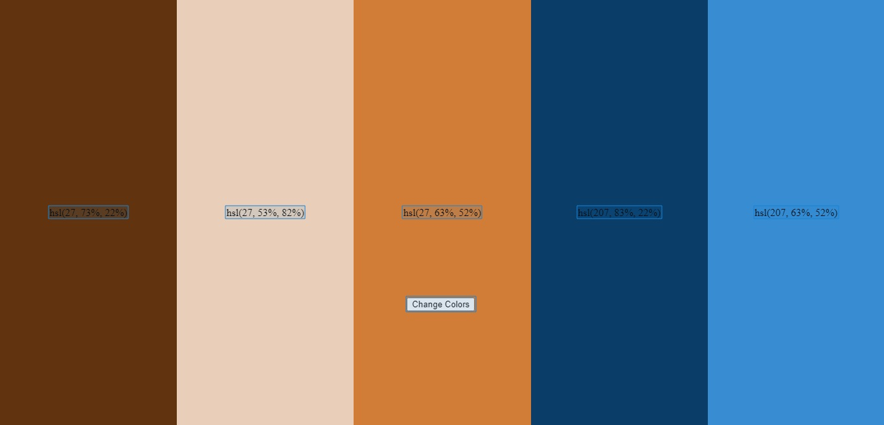

# Color Pallete Random

## Sobre

Esse projeto foi feito com o uma forma de aprimorar minhas abilidades em JavaScript

## Características

Gerar uma paleta de cores complementare de forma aleatória e mostar as cores em hsl

## Tecnologias usadas

- [HTML]
- [CSS]
- [JavaScript]

### Tela

  

---

Feito por Jackson Gravino